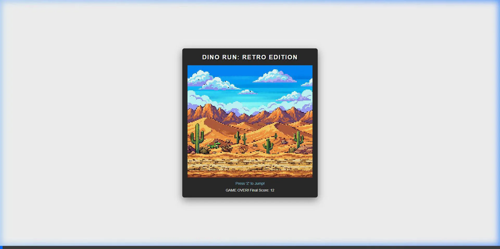

# 🕹️ Retro Engine

<p align="center">
  
</p>

<p align="center">
  <strong>A high-performance 2D retro game engine — Rust core, WebAssembly runtime, TypeScript SDK.</strong><br/>
  Write games like it's 2025. They look and sound like 1990.
</p>

<p align="center">
  <a href="#-getting-started">Getting Started</a> ·
  <a href="#-examples">Examples</a> ·
  <a href="#-sdk-usage">SDK Usage</a> ·
  <a href="#-editor">Editor</a> ·
  <a href="./docs/architecture.md">Architecture</a> ·
  <a href="./docs/contributing.md">Contributing</a>
</p>

---

## ✨ Features

| | |
|---|---|
| 🦀 **Rust Core** | ECS ([hecs](https://github.com/Ralith/hecs)), software RGBA renderer, audio synthesis — all platform-agnostic |
| ⚡ **WebAssembly** | `wasm-bindgen` + `wasm-pack` — near-native speed in any modern browser |
| 📦 **TypeScript SDK** | Fully-typed `Scene`, `Sprite`, `TileMap`, `SoundChannel`, `TouchControls` APIs |
| 🎨 **Custom Renderer** | Layered tilemaps, animated sprites, retro palette, scanline overlay, screen shake |
| 🎶 **Audio Synth** | 6 waveforms: Pulse 25%, Pulse 50%, Triangle, Sawtooth, Noise, Sine — all without any audio files |
| 🖥️ **Native Desktop** | Cross-platform runner via `winit` + `pixels` + `cpal` |
| 🗺️ **Tilemap Editor** | In-browser visual editor with layers, undo/redo, flood fill, pan/zoom, and JSON export |
| 🎮 **Input** | Keyboard, gamepad-style abstraction, and configurable on-screen touch controls |
| 🔧 **CLI** | Project scaffolding, dev server, and export commands |

---

## 🎮 Examples

### 🦖 T-Rex Runner
A side-scrolling endless runner with parallax background, physics, progressive difficulty, and screen shake on collision.

<p align="center">
  
</p>

```bash
cd examples/trex-game && bun dev   # http://localhost:3002
```

**Controls:** `Z` — Jump · `Enter` — Restart

---

### 👾 Space Invaders
A full Space Invaders clone with 100% procedurally-generated graphics (no image files!), 4-row enemy formations, wave progression, shields, screen shake, and multi-channel audio synthesis.

```bash
cd examples/space-game && bun dev  # http://localhost:3003
```

**Controls:** `← →` — Move · `Z` — Shoot · `Enter` — Start / Restart

Features:
- 3 enemy types (Squid 10pts · Crab 20pts · UFO 30pts) with animated sprites
- Enemy formations march and drop — speed increases each wave
- 4 destructible shield bunkers
- Invincibility frames + blink effect when hit
- Screen shake on death and wave clear (`engine.shake()`)
- Starfield tilemap background (procedurally seeded)
- Touch controls for mobile

---

### 🏃 Demo Platformer
A basic side-scroller demonstrating tilemap collision, animated character sprites, and projectiles.

```bash
cd examples/demo-game && bun dev   # http://localhost:3001
```

---

## 🚦 Getting Started

### Prerequisites

- [Rust](https://rustup.rs/) (stable toolchain)
- [wasm-pack](https://rustwasm.github.io/wasm-pack/installer/)
- [Bun](https://bun.sh/) ≥ 1.0 (or Node.js ≥ 20)

### Installation

```bash
git clone https://github.com/acathon/retor-engine.git
cd retor-engine

# Install JS dependencies
bun install

# Build WASM + SDK
bun run build:wasm
bun run build:sdk
```

### Development

```bash
# Run an example
cd examples/trex-game && bun dev

# Run the tilemap editor
cd packages/editor && bun dev

# Native desktop build
cargo run -p retro-platform-native -- examples/demo-game
```

### Full build

```bash
# Using npm scripts
npm run build:all

# Or using Make
make build
```

---

## 📦 Monorepo Structure

```
retor-engine/
├── crates/
│   ├── core/                 # Engine core — ECS, renderer, audio, input, physics
│   ├── platform-web/         # WASM bindings (wasm-bindgen, wasm-pack)
│   └── platform-native/      # Desktop runner (winit + pixels + cpal)
├── packages/
│   ├── sdk/                  # @retro-engine/sdk — TypeScript game SDK
│   ├── cli/                  # @retro-engine/cli — project tooling
│   └── editor/               # Browser-based tilemap editor
├── examples/
│   ├── demo-game/            # Platformer demo
│   ├── trex-game/            # Endless runner
│   └── space-game/           # Space Invaders clone
└── docs/
    ├── getting-started.md
    ├── architecture.md
    ├── contributing.md
    └── tutorial-trex.md
```

---

## 🧑‍💻 SDK Usage

### Bootstrap a game

```typescript
import { RetroEngine, Scene, Sprite, SoundChannel, TileMap } from '@retro-engine/sdk';

const canvas = document.getElementById('game') as HTMLCanvasElement;

// Presets: gameboy (160×144), nes (256×240), neogeo (320×224), or custom
const engine = await RetroEngine.nes(canvas, /* scale */ 3);
const scene = new Scene(engine);
```

### Load a sprite sheet and create a sprite

```typescript
const sheet = await engine.loadSheet('/hero.png', 16, 16); // tileW, tileH

const hero = new Sprite(scene, { x: 100, y: 80, sheet, frame: 0, layer: 10 });

// Animate
hero.play({ frames: [0, 1, 2, 1], fps: 8, loop: true });

// Move with velocity
hero.move(60, 0); // px/sec
```

### Build a tilemap

```typescript
const map = new TileMap(scene, { name: 'level1', cols: 32, rows: 30, tileWidth: 8, tileHeight: 8 });
const layer = map.addLayer('ground', sheet);
map.setTile(layer, 5, 10, 3);  // col, row, tileId
map.fill(layer, 0);             // fill entire layer
map.commit();                   // push to WASM renderer
```

### Audio synthesis — no files needed

```typescript
import { SoundChannel, NOTE } from '@retro-engine/sdk';

const sfx = new SoundChannel(engine, 0);  // channel 0
sfx.play(NOTE['C4'], 'triangle', 0.5);    // freq, waveform, volume
setTimeout(() => sfx.stop(), 150);

// Or play a melody
await sfx.melody([
  ['C4', 120], ['E4', 120], ['G4', 240], ['REST', 120],
]);
```

### Screen shake

```typescript
engine.shake(6, 0.4); // intensity (pixels), duration (seconds)
```

### Game loop

```typescript
engine.loop((dt) => {   // dt = delta time in seconds
  if (engine.input.held(0, 'right')) hero.x += 100 * dt;
  if (engine.input.justPressed(0, 'a')) jump();
  scene.update(dt);
});
```

### Touch controls

```typescript
import { TouchControls } from '@retro-engine/sdk';
new TouchControls(engine.input, document.body, { size: 100, opacity: 0.4 });
```

---

## 🗺️ Editor

The built-in tilemap editor runs entirely in the browser — no server required.

```bash
cd packages/editor && bun dev  # http://localhost:5173
```

**Features:**
- Multi-map tabs with per-map undo/redo (80-step history)
- Layered tilemaps — add, rename, reorder, toggle visibility, adjust opacity
- Tools: Draw · Erase · Flood Fill · Eyedropper · Rectangle
- Import any PNG as a sprite sheet — auto tile-slicer
- Pan (Space + drag) and zoom (Ctrl + scroll or slider)
- Ghost tile preview under cursor + minimap with viewport indicator
- Presets: Game Boy 20×18, NES 32×30, NeoGeo 40×28
- Autosave to `localStorage` every 10 seconds
- Export JSON in the engine's native tilemap format (ready for `engine.loadTileMap()`)
- Keyboard shortcuts: `D` Draw · `E` Erase · `F` Fill · `I` Pick · `R` Rect · `G` Grid · `Ctrl+Z/Y` Undo/Redo · `Ctrl+S` Save

---

## 🛠️ Tech Stack

| Layer | Technology |
|---|---|
| Engine core | Rust (stable), `hecs` ECS, `glam` math |
| Browser runtime | `wasm-bindgen`, `wasm-pack`, `wee_alloc` |
| Desktop runtime | `winit` 0.28, `pixels` 0.13, `cpal` |
| TypeScript SDK | ESM, strict, `vite-plugin-dts` |
| Bundler | Vite 5 |
| Package manager | npm workspaces / Bun |

---

## 📜 Documentation

- [Getting Started](./docs/getting-started.md)
- [Architecture Overview](./docs/architecture.md)
- [T-Rex Tutorial](./docs/tutorial-trex.md)
- [Contributing](./docs/contributing.md)

---

## 📄 License

MIT

---

## 🤝 Contributing

Contributions are welcome! Please feel free to submit a Pull Request.

---

## 📄 License

MIT License - Copyright (c) 2026 Retro Engine Team.
