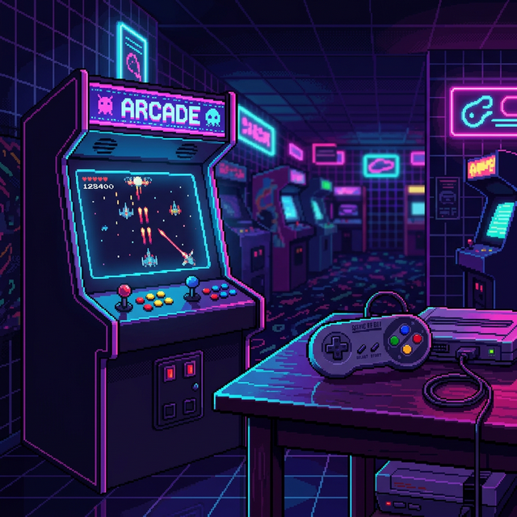

# Cathode



**A retro game engine with a Rust core, a WebAssembly runtime, a TypeScript SDK, a block-based visual editor, and a first-person raycaster.**

[Docs Hub](./docs/README.md) · [Getting Started](./docs/getting-started.md) · [First Game](./docs/first-game.md) · [Bounce Tutorial](./docs/tutorial-bounce.md) · [First-Person Tutorial](./docs/tutorial-bounce-3d.md) · [Architecture](./docs/architecture.md) · [Contributing](./docs/contributing.md)

Cathode is for people who want the feel of old-school consoles without giving up modern tooling. Build with blocks if you have never written code, graduate to the TypeScript SDK when you outgrow them, and drop into the Rust core when you need to. Twelve complete games live in this repository, and none of them is a stub.

## Start Here

Choose the shortest path for what you want to do:

| Goal | Start here |
| --- | --- |
| Run something immediately | [docs/getting-started.md](./docs/getting-started.md) |
| Build a game without writing code | [Cathode Studio](#cathode-studio) |
| Build a tiny playable game | [docs/first-game.md](./docs/first-game.md) |
| Build a physics game, step by step | [docs/tutorial-bounce.md](./docs/tutorial-bounce.md) |
| Build a first-person game | [docs/tutorial-bounce-3d.md](./docs/tutorial-bounce-3d.md) |
| Learn by reading a full example | [docs/tutorial-trex.md](./docs/tutorial-trex.md) |
| Understand the engine internals | [docs/architecture.md](./docs/architecture.md) |
| Contribute fixes or features | [docs/contributing.md](./docs/contributing.md) |

## What You Get

| Area | Included |
| --- | --- |
| Engine core | Rust ECS, software renderer, audio synth, physics with tilemap collision, camera, particles, tweens, timers |
| First person | DDA raycaster with textured walls, billboards, fog, a z-buffer, pitch and eye height |
| Shooting and AI | Hitscan ray queries, line-of-sight tests, A* pathfinding over the same cells the renderer draws |
| Netplay | Fixed-step clock, deterministic lockstep, snapshot interpolation (transport-agnostic — see [Multiplayer](#multiplayer)) |
| Runtime targets | Browser via WASM and native desktop via winit/pixels/cpal |
| SDK | TypeScript APIs for scenes, sprites, tilemaps, input, audio, text, save data, raycasting |
| Visual editing | Cathode Studio: scene tree, inspector, block editor, pixel sprite editor, sound maker, map editor |
| Learning material | Setup guide, four tutorials, architecture reference, twelve example games |
| Tests | 279 Rust and 54 TypeScript, run by CI on every push |

## Quick Start

### 1. Install the prerequisites

- [Rust](https://rustup.rs/)
- [wasm-pack](https://rustwasm.github.io/wasm-pack/installer/)
- [Bun](https://bun.sh/) 1.x

### 2. Clone and install

```bash
git clone https://github.com/acathon/retor-engine.git
cd retor-engine
bun install
```

### 3. Build the engine pieces used by the examples

```bash
bun run build:wasm
bun run build:sdk
```

### 4. Run an example

```bash
cd examples/trex-game
bun dev
```

Then open the local Vite URL shown in the terminal.

## New Developer Checklist

If you are new to the repo, this order is the fastest way to become productive:

1. Run one example game.
2. Read [docs/getting-started.md](./docs/getting-started.md).
3. Build the tutorial in [docs/first-game.md](./docs/first-game.md).
4. Work through [docs/tutorial-bounce.md](./docs/tutorial-bounce.md), which builds a complete game and explains why each number is what it is.
5. Open one example from the table below and trace how it is structured.
6. Use [docs/architecture.md](./docs/architecture.md) only after you know which subsystem you need.

## Examples

These examples are part demo, part reference implementation.

| Example | Folder | What it teaches |
| --- | --- | --- |
| Demo platformer | `examples/demo-game` | Side-scrolling movement, tilemap usage, simple collisions |
| T-Rex runner | `examples/trex-game` | Endless-runner structure, obstacle spawning, restart loop |
| Space game | `examples/space-game` | Procedural art, waves, projectiles, touch controls |
| Tetris | `examples/tetris` | Grid logic, HUD rendering, piece systems |
| Ice hockey | `examples/ice-hockey-game` | Team AI, state machines, period and score management |
| Metal Slug-inspired demo | `examples/metal-slug` | Multi-layer scenes, scrolling action pacing |
| Doom-style demo | `examples/doom-game` | Raycaster setup, billboards, atmospheric rendering |
| Cavern Dash | `examples/cavern-dash` | Engine-driven physics: tilemap collision, gravity, `usePhysics` |
| Crypt Courier | `examples/crypt-courier` | Procedural maze, first-person raycasting, billboards, fog |
| **Bounce** | `examples/bounce-classic` | Bouncing physics, buoyancy, charge jumps — [tutorial](./docs/tutorial-bounce.md) |
| **Bounce 3D** | `examples/bounce-raycaster` | The same game in first person: eye height, horizon pitch, sprite elevation — [tutorial](./docs/tutorial-bounce-3d.md) |
| **Dust Protocol** | `examples/dust-protocol` | Round-based FPS: hitscan, A* bots, line of sight, tab-to-tab netplay |

Every example runs standalone:

```bash
cd examples/dust-protocol && bun dev
```

## Bun-First Commands

These are the most useful commands for daily work:

| Task | Command |
| --- | --- |
| Install dependencies | `bun install` |
| Build web bindings | `bun run build:wasm` |
| Build SDK package | `bun run build:sdk` |
| Build CLI package | `bun run build:cli` |
| Build everything exposed by root scripts | `bun run build:all` |
| Run the web editor | `bun run dev:editor` |
| Run Cathode Studio | `bun run dev:studio` (needs `build:wasm` + `build:sdk` first) |
| Run the demo example | `bun run dev:demo` |
| Build an example | `cd examples/doom-game && bun run build` |
| Run the test suite | `make test` |
| Run linters and formatting checks | `make lint` |

## Multiplayer

The engine ships the portable half of netplay in `crates/core/src/netcode`:

- **`Clock`** — a fixed step, so every machine simulates the same number of
  ticks per second no matter what its frame rate is.
- **`Lockstep`** — hold a tick until every player has reported an input, with
  a delay window to absorb latency. Deterministic: nobody sends world state.
- **`Interpolator`** — blend the sparse snapshots a server actually sends into
  per-frame positions, holding rather than extrapolating past the newest one.

It deliberately opens **no sockets**. The browser wants WebRTC or a WebSocket,
native wants UDP, and neither belongs in a portable core — so the transport is
yours to supply.

`examples/dust-protocol/src/net.ts` supplies one with `BroadcastChannel`, which
carries players between tabs of the same browser. Open the shooter in two tabs
and the second joins the match as a live opponent, taking a bot's slot. That is
a real transport with a real limit: it reaches other tabs on this machine and
nothing else. The message shapes in that file are the entire protocol, so
reaching another machine means replacing two methods and nothing above them.

## Cathode Studio

A visual editor laid out like Godot: a scene tree on the left, an inspector on
the right, a live viewport in the middle, and a tabbed dock underneath holding
the block editor, a pixel sprite editor, a sound maker, the generated
TypeScript, and an output log.

```bash
bun run build:wasm && bun run build:sdk   # the studio runs the real engine
bun run dev:studio
```

Each sprite owns its own pixels and its own stack of blocks, the way Scratch
works. Blocks are not a dead end: the Code tab shows the TypeScript your
blocks generate, in the same style as the examples in this repo, so a project
can graduate to hand-written code without starting over.

Studio projects come in two modes. **2D** gives you a scene editor you drag
sprites around in; **Raycaster** swaps the viewport for a first-person view
and the scene editor for a grid map editor you paint walls into. The First
Person block category drives it — move, strafe, turn, teleport, set fog, and
ask how far the wall ahead is — so a first-person game is buildable without
writing a line of code.

## Monorepo Map

```text
retor-engine/
├── crates/
│   ├── core/               # Portable Rust engine core: ECS, renderer, audio,
│   │                       #   physics, raycaster, pathfinding, netcode
│   ├── platform-web/       # WebAssembly bindings
│   └── platform-native/    # Native desktop runtime
├── packages/
│   ├── sdk/                # TypeScript game SDK
│   ├── cli/                # `cathode` CLI
│   ├── editor/             # Browser-based editor
│   ├── editor-desktop/     # Tauri desktop editor
│   ├── blocks/             # Block language: IR, interpreter, TypeScript codegen
│   └── studio/             # Cathode Studio: scene tree, inspector, blocks,
│                           #   pixel sprite editor, sound maker, map editor
├── examples/               # Reference games and demos
└── docs/                   # Onboarding, tutorials, architecture, contribution docs
```

## Recommended Reading Paths

### I want to make my first game

1. [docs/getting-started.md](./docs/getting-started.md)
2. [docs/first-game.md](./docs/first-game.md)
3. One example folder closest to your genre

### I want to use the CLI

1. `packages/cli/src/index.ts`
2. [docs/getting-started.md](./docs/getting-started.md)
3. `packages/cli/src/commands/`

### I want to build a first-person game

1. [docs/tutorial-bounce-3d.md](./docs/tutorial-bounce-3d.md)
2. `crates/core/src/raycaster/` for what the renderer can do
3. `examples/dust-protocol/` for hitscan, bots and netplay

### I want to extend the engine

1. [docs/architecture.md](./docs/architecture.md)
2. `crates/core/src/`
3. [docs/contributing.md](./docs/contributing.md)

## Documentation

- [Docs Hub](./docs/README.md)
- [Getting Started](./docs/getting-started.md)
- [Build Your First Game](./docs/first-game.md)
- [T-Rex Tutorial](./docs/tutorial-trex.md)
- [Bounce Tutorial](./docs/tutorial-bounce.md)
- [Bounce in First Person](./docs/tutorial-bounce-3d.md)
- [Architecture](./docs/architecture.md)
- [Contributing](./docs/contributing.md)

## Community Readiness Notes

This repository already contains substantial engine code, examples, and editor work. The docs in this repository are intended to make that codebase usable by:

- first-time game developers who need a guided path,
- experienced developers who want subsystem documentation,
- contributors who need repo conventions and validation commands.

If you are opening an issue or planning a contribution, start with [docs/contributing.md](./docs/contributing.md).

## Repository Name Note

The GitHub repository is named `retor-engine` for historical reasons. The engine itself is **Cathode**: Rust crates are published as `cathode-*` and TypeScript packages under the `@cathode/` scope.

## License

MIT
