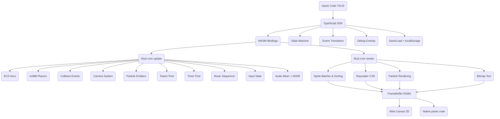
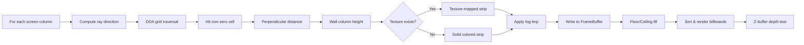
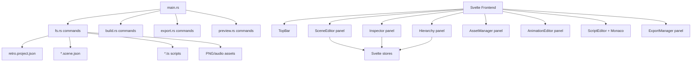
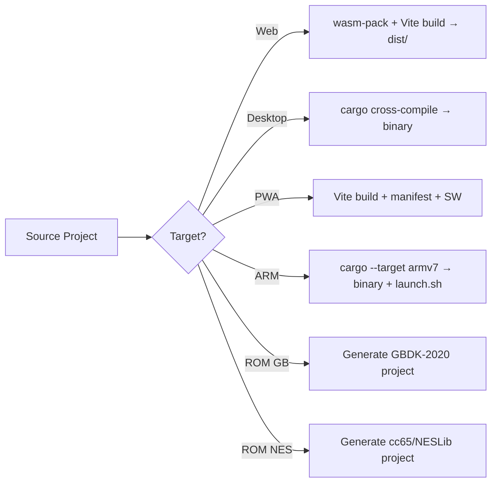

# Architecture

## Overview

retro-engine is a retro game engine with a Rust core, WASM bindings for web,
a native desktop runner, a TypeScript SDK, a CLI, and a Tauri-based desktop editor.

## Data-Flow Diagram

## Module Map

### Rust Core (`crates/core`)

| Module | File | Purpose |
|--------|------|---------|
| ECS | `ecs/mod.rs` | hecs-based entity-component system |
| Renderer | `renderer/mod.rs` | RGBA software renderer, sprite batching, scanlines |
| Physics | `physics/mod.rs` | AABB collision resolution, velocity/gravity |
| Audio | `audio/mod.rs` | 6-waveform chiptune mixer (44.1kHz) |
| Audio Envelope | `audio/envelope.rs` | ADSR envelope with presets (pluck, pad, snare, bass) |
| Sequencer | `audio/sequencer.rs` | MML pattern sequencer for background music |
| Collision | `collision/mod.rs` | Event-driven collision queue (CollisionEvent, CollisionSide) |
| Camera | `camera/mod.rs` | Lerp follow, dead zone, bounds clamping, zoom |
| Particles | `particles/mod.rs` | Emitters, bursts, continuous emission, rendering |
| Tween | `tween/mod.rs` | Easing pool (7 functions), yoyo, repeat |
| Text | `text/mod.rs` | BitmapFont rendering from sprite sheet |
| Timer | `timer/mod.rs` | Managed timer pool with fire events |
| Raycaster | `raycaster/mod.rs` | DDA raycaster with textured walls, billboards, fog |
| Save | `save/mod.rs` | 4-slot save manager with serde JSON |
| Input | `input/mod.rs` | Keyboard + gamepad abstraction |
| Assets | `assets/mod.rs` | Sprite sheet storage |
| Scene | `scene/mod.rs` | Scene management |
| Config | `config.rs` | Engine presets (Game Boy, NES, Neo Geo) |

### Raycaster Pipeline

### WASM Bindings (`crates/platform-web`)

Exposes ~60+ `#[wasm_bindgen]` functions wrapping the Engine struct:
- Core: `init`, `update`, `render`, `upload_sheet`, `shake`
- Collision: `poll_collisions`, `add_collider`, `set_solid`
- Camera: `set_camera_target/lerp/bounds/dead_zone/zoom`, `get_camera_pos`
- Particles: `create_emitter`, `emitter_burst`, `emitter_set_pos`, `destroy_emitter`
- Tweens: `tween_create/value/is_complete/reset/destroy`
- Text: `register_font`, `draw_text`, `measure_text`
- Timers: `timer_create/start/stop/reset/progress`, `poll_fired_timers`
- Audio: `play/stop`, `audio_set_envelope/preset`
- Sequencer: `sequencer_load_mml/play/stop/pause/set_bpm`
- Raycaster: `raycaster_init/set_texture/move/set_pos/get_pos/add_billboard/remove_billboard/set_fog/set_floor_color/set_ceiling_color`
- Save: `save_set/get/remove/export/import`
- Debug: `draw_overlay_rect`, `debug_draw_rect`

### Native Platform (`crates/platform-native`)

- **Window**: winit 0.28 event loop
- **Rendering**: pixels 0.13 (RGBA framebuffer → GPU texture)
- **Audio**: CPAL 0.15 output stream, `Engine::audio.fill_stereo()` in callback
- **Gamepad**: gilrs 0.10, button mapping to engine GamepadState

### TypeScript SDK (`packages/sdk`)

| Module | Purpose |
|--------|---------|
| `engine.ts` | RetroEngine class, game loop, preset constructors |
| `sprite.ts` | Sprite class wrapping ECS entities |
| `scene.ts` | Scene lifecycle, `follow()` |
| `tilemap.ts` | TileMap with collision helpers (setSolidTiles, isSolid, raycast) |
| `input.ts` | InputReader polling WASM input state |
| `audio.ts` | SoundChannel wrapping WASM audio |
| `camera.ts` | Camera API (follow, lerp, dead zone, bounds, zoom) |
| `particles.ts` | ParticleEmitter with presets (explosion, sparkle, dust, coin) |
| `tween.ts` | Tween with callbacks, `tweenSprite()` helper |
| `text.ts` | BitmapFont with `builtin()` procedural font |
| `timer.ts` | GameTimer with fire callbacks |
| `state-machine.ts` | Pure TS StateMachine (no WASM) |
| `transitions.ts` | Scene transitions (fade, slide, pixelate, checkerboard) |
| `music.ts` | MusicPlayer wrapping sequencer |
| `raycaster.ts` | Raycaster with texture upload, billboard management |
| `save.ts` | SaveManager with localStorage autosave/autoload |
| `debug.ts` | DebugOverlay (F3 toggle, FPS/entity/particle display) |
| `touch.ts` | TouchControls overlay for mobile |

## Tauri Desktop Editor (`packages/editor-desktop`)

**Panels:**
- **SceneEditor**: 2D canvas with grid, drag entities, pan/zoom, minimap, undo/redo (80 ops)
- **Inspector**: Edit entity properties (position, layer, collider, animations, script, custom props)
- **Hierarchy**: Sorted entity tree with visibility toggle, rename, reorder
- **AssetManager**: Grid view of sprites/scripts/scenes/maps with import
- **AnimationEditor**: Frame timeline, FPS slider, loop toggle, preview
- **ScriptEditor**: Monaco Editor with TypeScript, auto-save
- **ExportManager**: One-click export to web/desktop/ARM/ROM targets with build log

## Platform Targets

| Target | Method | Binary |
|--------|--------|--------|
| Web (HTML5) | WASM + Vite bundle | `dist/` |
| Desktop (Windows) | `cargo build --target x86_64-pc-windows-gnu` | `.exe` |
| Desktop (macOS) | `cargo build --target aarch64-apple-darwin` | binary |
| Desktop (Linux) | `cargo build --target x86_64-unknown-linux-gnu` | binary |
| ARM Linux (Handhelds) | `cargo build --target armv7-unknown-linux-gnueabihf` | binary |
| PWA | Vite build + manifest.json + service worker | `dist/` |
| ROM-ready (Game Boy) | GBDK-2020 project scaffold | C source project |
| ROM-ready (NES) | cc65/NESLib project scaffold | C source project |

## Export Pipeline

## ECS
The `hecs` crate acts as the backing simulation for all game entities and sprites. The web API translates ID handles so JavaScript can orchestrate components without touching Rust memory directly.

## Renderer Pipeline
1. `FrameBuffer::clear()`
2. **Raycaster pass** (if enabled): DDA wall rendering, billboard sprites, fog
3. Tile layers (back to front, with fixed layers ignoring camera offset)
4. ECS Sprites, queried via `Query<(&Position, &SpriteIndex)>` and sorted by `layer`
5. Particle rendering (colored squares with fade/shrink)
6. Bitmap text overlay
7. Debug overlay (collider wireframes, FPS)
8. Scanlines post-process step applied over the RGBA buffer

## Audio Pipeline
44.1kHz sample rate output. The mixer iterates over a configurable number of `Channel`s.
Each channel has:
- Waveform generator (sine, square, triangle, sawtooth, pulse, noise)
- ADSR envelope multiplier
- Frequency and volume control

The `Sequencer` feeds note events into channels based on MML patterns and BPM.
Supported waveforms use integer/phase math. Noise leverages a 15-bit Galois LFSR for classic authentic static.

## Platform Targets
| Platform | Renderer | Audio | Input |
|---|---|---|---|
| Web (Default) | \`HtmlCanvasElement\` | \`AudioContext/ScriptProcessorNode\` | DOM Events |
| Desktop (Native) | \`pixels + winit\` | \`cpal\` | \`winit\` keyboard/gamepad events |
